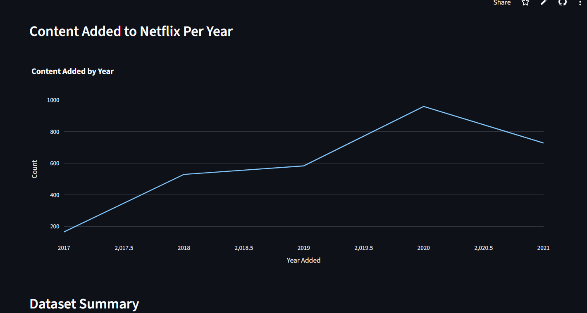
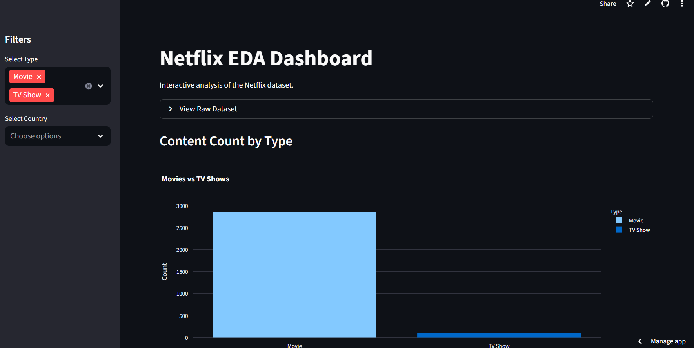
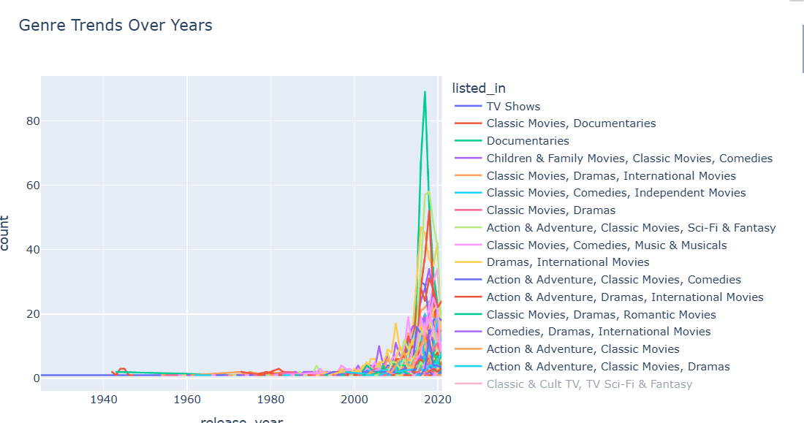
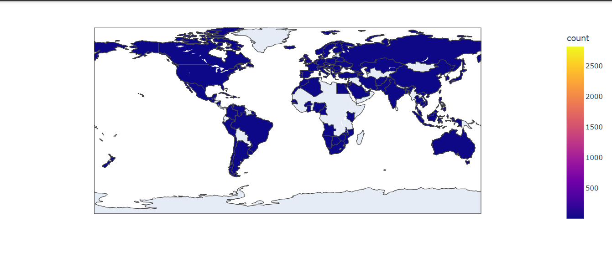

# 🎬📊 Netflix Dashboard  


### Click Here 👉 [](https://netflix-eda-dashboard-project.streamlit.app/)


> An interactive **Streamlit dashboard** and **EDA project** built on the **Netflix Movies and TV Shows dataset**.  
> Explore global content trends, genres, and distributions across countries and years. 🍿🌍  

---

## ✨ Features

- **📊 Data Cleaning & EDA** – Performed in Jupyter Notebook  
- **🎛 Interactive Dashboard** – Built with **Streamlit**  
- **📈 Visualizations** – Dynamic plots with **Plotly**  
- **🌍 Global Filters** – By Country, Year, Genre, and Type (Movie/TV Show)  
- **🔍 Insights** – Discover viewing trends and catalog patterns  

---

## 📂 Project Structure

```plaintext
📂 netflix-dashboard/
 ├── 📜 app.py               # Main Streamlit application
 ├── 📄 requirements.txt     # Required Python packages
 ├── 📓 notebooks/           # Jupyter notebooks with EDA
 ├── 📊 data/                # Processed dataset
 └── 📄 README.md            # Project documentation

```

## ✨ Features
- 📊 Data cleaning & exploratory analysis (EDA) in Jupyter Notebook  
- 🎛 Interactive dashboard with Streamlit  
- 📈 Plotly visualizations for trends & distributions  
- 🌍 Filters for Country, Year, Genre, and Type  

---


## 🚀 Run Locally
```
# 1️⃣ Clone the repository
git clone https://github.com/<your-username>/netflix-dashboard.git

# 2️⃣ Navigate to the project folder
cd netflix-dashboard

# 3️⃣ Install dependencies
pip install -r requirements.txt

# 4️⃣ Run the app
streamlit run app.py
```

## 📊 Insights

US & India dominate Netflix’s catalog

Surge in TV Shows post-2015

Top genres: Dramas, International Movies, Comedies


## 🖼 Preview
### Dashboard 
<p float="left">
  
  
</p>

<p float="left">
  
  
</p>


## 👤 Author
### Amisha
💌 Passionate about data, design, and delivering delightful experiences


## ⭐ Show Some Love

If you like this project, please ⭐ it on GitHub and share it with your friends!


## 📜 License

This project is licensed under the MIT License.
Feel free to fork, modify, and build upon it. 🎬
 

